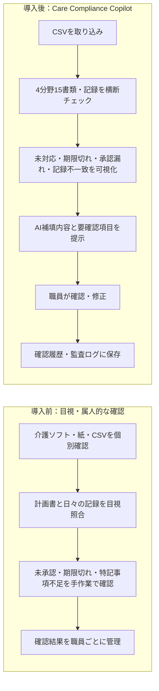

# **Care Compliance Copilot**

## **概要**

訪問介護事業所における運営指導前の書類確認業務を支援する、コンプライアンス確認AI支援MVPです。

本プロジェクトでは、利用者情報・ケアプラン・日々の介護記録・モニタリング記録・書類ステータスをCSVで読み込み、未作成・未確認・未承認の書類や記録を検知します。  
さらに、必要に応じてAI下書き候補を生成し、職員が確認・修正したうえで「職員確認済み」として保存する業務フローを検証しています。

## **本MVPの見どころ**

* R011デモで、サービス提供記録の不足レ点、不一致候補、特記事項補填をBefore/Afterで確認できます
* AIは確定せず、職員確認と監査ログを必須にしています
* 4分野15書類・記録カタログを対象に、運営指導前の未対応を可視化します
* 職員入力は勝手に削除せず、要確認項目として表示します
* 確認済み記録の全体図確認、修正、修正履歴の追加まで確認できます

## **背景**

訪問介護事業所では、運営指導前に以下のような書類確認が必要になります。

* 訪問介護計画書が有効期間内に作成されているか  
* 月間モニタリング記録が作成・確認されているか  
* 日々の介護記録に必要な情報が記載されているか  
* 書類が未作成・未確認・未承認のまま残っていないか  
* 記録内容をもとに、モニタリング文書や特記事項を適切に補足できるか

しかし、これらを人手で確認する場合、確認漏れや対応遅れが発生しやすく、サービス提供責任者や管理者の負担も大きくなります。

本MVPでは、こうした課題に対して、CSVデータをもとに書類状態を検知し、必要な文書作成をAI下書き候補として支援する流れを検証しました。

## **ビジネスケース**

### As-Is：現状課題

訪問介護事業所では、運営指導前に訪問介護計画書、サービス提供記録、モニタリング記録、契約・同意書類、職員関連書類などを横断的に確認する必要があります。

しかし、確認作業は介護ソフト、CSV、紙書類、職員の個別管理に分散しやすく、以下の課題があります。

* 書類の未作成、未承認、期限切れの見落とし
* 訪問介護計画書と日々の記録の不一致
* サービス提供記録のレ点漏れ、特記事項不足
* AI下書きや確認待ち記録の未確認
* 監査前チェック作業の属人化
* 確認履歴が残らず、誰が何を確認したか説明しづらい

### To-Be：本MVPで目指す姿

Care Compliance Copilotでは、4分野15書類・記録カタログに基づき、CSVデータを横断的に確認し、未対応、期限切れ、承認漏れ、記録不一致を可視化します。

AIは記録を確定せず、不足候補、下書き、要確認項目を提示するだけに留めます。  
最終判断は職員が行い、確認結果は監査ログとして残します。

### 想定効果

本MVPは実証前のプロトタイプであり、以下は仮説値です。

* 監査前チェック作業の確認漏れ低減
* 書類・記録確認の属人化軽減
* 不足記録や未承認書類の早期発見
* 職員確認履歴・監査ログによる説明責任の向上
* 監査前セルフチェック時間の30〜50%削減を目標
* サービス提供責任者や管理者が、未対応書類・記録を一覧で確認できる状態を目指す

## **業務フロー Before / After**



## **主な機能**

* **書類・記録アラート検知**：4分野15書類・記録カタログに基づき、未作成・未承認・期限切れ・レ点不一致候補・特記事項不足・AI下書き未確認などをルールベースで検知します
* **一本道の業務フロー**：概要ダッシュボード→書類アラート一覧→書類詳細・AI補填プレビュー→確認キュー→確認履歴・監査ログという主要導線に沿って、対応が必要な書類・記録を確認できます
* **AI下書き候補の生成**：特記事項補填案・月間モニタリング下書きを、既存の記録項目（特記事項・本人発言・観察事項・数値情報・今後の対応など）の範囲内でのみ生成します。存在しない事実や医学的判断は追加しません
* **職員確認済みとしての保存**：確認者・確認日時・確認済みステータスを記録し、AIが自動で書類を確定するのではなく最終判断を職員が行う設計です
* **概要ダッシュボード**：総検知アラート数（累計・確認済みでも減らない）、未対応書類・記録件数、高リスク未対応書類・記録件数、確認済み書類・記録件数を書類・記録単位で可視化します
* **確認履歴・監査ログ**：確認操作ごとにタイムラインカードで表示します。確認済み記録の修正は既存ログを上書きせず、新しいイベントとして追記します
* **補助画面**：アラート根拠確認・計画書連動レ点候補・特記事項AI補填デモ・月間モニタリングAI下書き・職員確認済み保存など、個別の確認作業を単独画面でも実施できます

いずれの画面でも、AIやルールは記録・書類・レ点チェックを確定しません。下書き・候補・不一致検知を提示するのみで、最終確定は必ず職員が確認・修正・保存します。

## **デモ用サービス提供記録 R011**

R011は「身体介護サービスの記録に生活援助のレ点（清掃）が混ざり、かつ計画書上必要な水分補給促し・体調観察が不足している」ケースを想定したデモです。「書類アラート一覧」の最上部に「★ デモ用：サービス提供記録AI補填体験」として常に表示されます。

書類アラート一覧からR011を開くと、Before画面で元記録を確認し、AI補填プレビューで不足レ点・特記事項補填・要確認項目を確認できます。不一致候補がある場合は職員確認済みにする前に最終警告が表示され、職員が確認したうえで保存します。職員確認済みにすると、確認履歴・監査ログに保存され、概要ダッシュボードの書類・記録単位カウントにも反映されます。保存後は「確認履歴・監査ログ」から全体図の確認・修正版としての保存も行えます。

確認履歴・監査ログは、GitHub公開直後やクローン直後は空の状態から始まり、「使い方・業務フロー」画面の「開発・デモ用：デモ状態をリセットする」からいつでも初期状態に戻せます（`sample_outputs/`は変更されません）。

詳細な操作手順は [`docs/r011_demo_flow.md`](docs/r011_demo_flow.md) を参照してください。

## **使用データ**

本MVPでは、実在個人情報を含まないデモ用CSVを使用しています。

主な入力データは以下です。

| ファイル名 | 内容 |
| ----- | ----- |
| `users.csv` | 利用者情報 |
| `care_plans.csv` | ケアプラン情報 |
| `daily_records.csv` | 日々の介護記録 |
| `monitoring_records.csv` | 月間モニタリング記録 |
| `document_status.csv` | 4分野15書類・記録カタログに基づく書類ステータス |
| `document_detail_samples.csv` | 書類詳細画面の紙面風表示用デモデータ |

Notebook実行後、または`app.py`の操作後に生成される出力データ（`outputs/alerts_integrated.csv`・`confirmation_queue_log.csv`など）や、GitHub公開用に列構成のみを保持した`sample_outputs/`の位置づけを含め、詳細なデータ仕様は [`docs/data_spec.md`](docs/data_spec.md) を参照してください。

## **ファイル構成**

```text
care-compliance-copilot/
├── README.md
├── app.py（Streamlit版アプリ）
├── requirements.txt
├── notebook/
│   └── care_compliance_copilot_mvp.ipynb
├── data/
│   ├── users.csv
│   ├── care_plans.csv
│   ├── daily_records.csv
│   ├── monitoring_records.csv
│   ├── document_status.csv
│   └── document_detail_samples.csv（書類全体図の紙面表示用MVPデモデータ）
├── outputs/（実行時生成物。Git管理対象外、.gitkeepのみ追跡）
├── sample_outputs/（GitHub公開用の固定サンプル出力）
│   ├── alerts_integrated.csv
│   ├── alert_summary_by_user.csv
│   ├── confirmation_queue_log.csv
│   ├── daily_records_with_ai_note_draft.csv
│   ├── daily_records_note_reviewed.csv
│   ├── monitoring_records_with_ai_draft.csv
│   └── monitoring_records_reviewed.csv
└── docs/
    ├── r011_demo_flow.md（R011デモの詳細操作手順）
    ├── data_spec.md（データ仕様の詳細）
    └── screenshots/
```

## **実行方法**

### Streamlitアプリ（app.py）

ロジック検証済みのStreamlit版アプリをローカルで起動できます。

```
pip install -r requirements.txt
streamlit run app.py
```

起動後、サイドバーのメニューから、書類を中心にした一本道の業務フロー（概要ダッシュボード→書類アラート一覧→書類詳細・AI補填プレビュー→確認キュー→確認履歴・監査ログ）と、個別確認用の補助画面を確認できます。まずは「書類アラート一覧」最上部のデモ用サービス提供記録（R011）から操作するのがおすすめです（[`docs/r011_demo_flow.md`](docs/r011_demo_flow.md)参照）。

### Notebook（検証用ロジック）

Google Colabで`notebook/care_compliance_copilot_mvp.ipynb`を開き、Google Driveをマウント・CSVデータを読み込んだうえで、すべてのセルを上から実行します。CSV読み込み→データ前処理→ルールベース判定→統合アラート作成→AI下書き作成→職員確認済み保存、という順に処理し、最後に統合アラート・AI補填案・確認済みステータス・計画書と書類ステータスの有効期間整合性などの最終チェックを行い、主要フローが正常に完了していることを確認します。

## **設計上のポイント**

### AIは確定文書を作成しない

本MVPでは、AIの出力はあくまで下書き候補として扱います。  
AIが自動で正式記録を確定するのではなく、職員が確認・修正したうえで保存する設計にしています。

### 現場職員が次に確認すべき内容を明確にする

優先度を0〜100点で表示するのではなく、未作成・未承認・未確認の状態別に対象書類名を表示します。  
これにより、職員が「何を確認すべきか」を直感的に把握できるようにしています。

### 記録に存在しない事実をAIが追加しない

AI下書き生成では、日々の記録やケアプランに存在する情報のみを使用するルールを明記しています。  
存在しない発言・症状・支援内容・医学的判断を推測して追加しないことを重視しています。

## **今後のロードマップ**

本MVPはCSVベースのプロトタイプです。本番導入を想定した場合、以下を段階的に検討します（いずれも現時点の`app.py`には未実装です）。

### 1. 既存介護ソフトとの連携

本MVPではCSV取り込みを前提としています。事業所ごとに利用する介護ソフトが異なるため、まずはCSVエクスポートを前提に価値検証を行っています。今後は、介護ソフトからの定期CSVエクスポート、API連携、夜間バッチ処理による自動チェック、チェック結果の定期レポート化を想定します。

### 2. 入力データの拡張

訪問介護計画書PDFの自動読み取り（現状は`care_plans.csv`を構造化済みデータとして扱っている）、担当者会議記録・研修記録・苦情処理記録の中身データモデル化とAI補填の実装、計画書連動レ点候補のマッチング精度向上（表記ゆれ吸収など）、同一record_id/monitoring_idの重複チェックまたは上書き保存を検討します。

### 3. 個人情報マスキング

本MVPでは実在個人情報を使用せず、デモ用CSVのみを扱っています。本番導入時には、外部LLMやクラウド環境へ送信する前に、氏名・住所・生年月日・電話番号・利用者ID・自由記述内の個人情報・本人発言に含まれる識別情報をマスキングする方針です。また、送信ログ、データ保持期間、二次利用防止、利用者同意、事業所内規程との整合性を確認する必要があります。

### 4. 権限管理

本番運用では、管理者・サービス提供責任者・訪問職員などの役割に応じて、閲覧・修正・承認範囲を制御します（例：管理者は全体ダッシュボード・監査ログ・設定管理、サービス提供責任者はサービス提供記録・計画書・モニタリング記録の確認、訪問職員は担当利用者の記録確認・下書き修正）。

### 5. 監査ログ強化

確認済み記録の修正履歴、修正者、修正日時、修正理由を保持し、運営指導時に説明可能なログとして出力できるようにします。

### 6. 効果測定

導入前後で監査前チェック時間、確認漏れ件数、差戻し件数、未承認書類件数、職員確認工数、書類確認にかかる管理者負担を比較し、業務改善効果を測定します。

## **使用技術**

* Python  
* pandas  
* Streamlit  
* Google Colab  
* CSV  
* 生成AIプロンプト設計

## **位置づけ**

本プロジェクトは、商用利用を前提とした完成品ではなく、訪問介護事業所における書類確認業務の効率化を検証するMVPです。

目的は、以下の価値を検証することです。

* 書類不備や未確認記録の見落としを減らせるか  
* 運営指導前の確認作業を効率化できるか  
* 記録内容に基づいた文書下書きを作成できるか  
* AI出力を職員確認前提で扱うことで、安全な現場運用に近づけられるか  
* Notebookで検証したロジックを、今後Streamlitアプリとして画面化できるか
